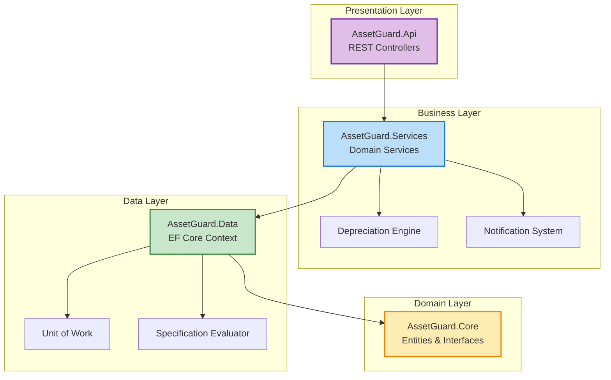
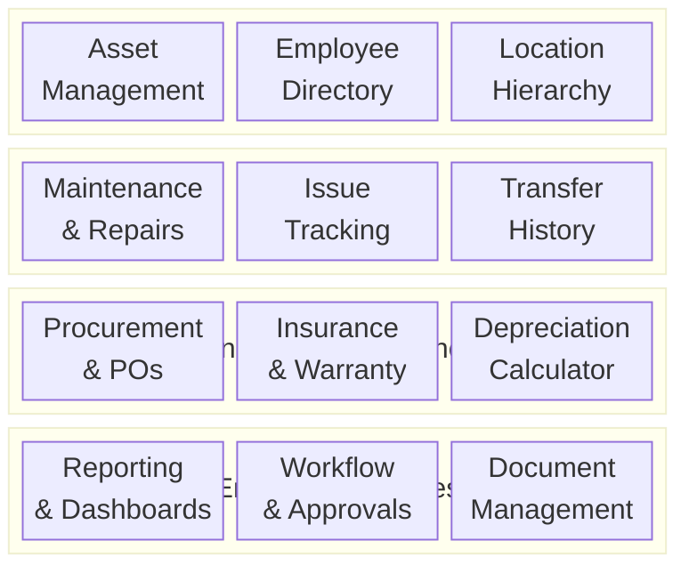
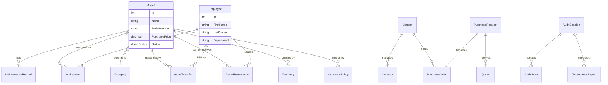
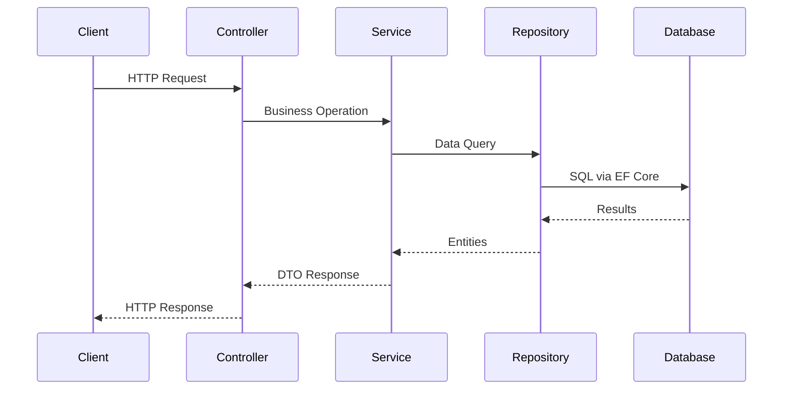
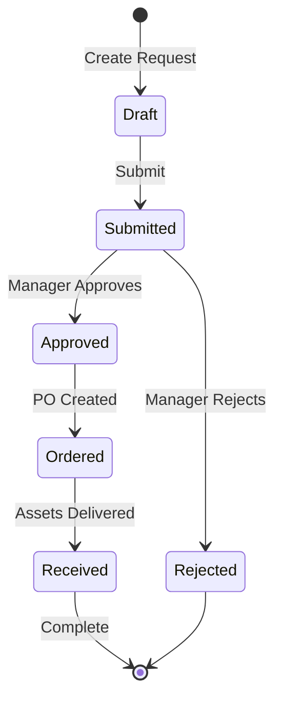

# AssetGuard

AssetGuard is a comprehensive corporate asset tracking and management application built with **.NET Core 2.1**, adhering to enterprise architectural patterns.

## System Architecture

## Module Overview

## Entity Relationships

## Request Flow

## Procurement Workflow

## Key Modules

| Module | Description | Key Entities |
|--------|-------------|--------------|
| **Assets** | Core tracking, categorization, assignments | Asset, Category, Assignment |
| **Maintenance** | Repairs, vendor management | MaintenanceRecord, Vendor, Contract |
| **Issues** | Ticketing, job scheduling | Issue, Job |
| **Procurement** | Purchase requests, POs, quotes | PurchaseRequest, Quote, PurchaseOrder |
| **Audit** | Physical inventory verification | AuditSession, AuditScan, DiscrepancyReport |
| **Insurance** | Warranty & policy tracking | Warranty, InsurancePolicy |
| **Reservations** | Asset booking system | AssetReservation |
| **Transfers** | Location/ownership changes | AssetTransfer |
| **Reporting** | Dashboards, scheduled reports | ReportDefinition, DashboardWidget |
| **Notifications** | Alerts, subscriptions | Notification, NotificationTemplate |
| **Documents** | Version-controlled files | Document, DocumentVersion |
| **Workflows** | Approval processes | Workflow, ApprovalRequest |

## Getting Started

1. Ensure .NET Core 2.1 SDK is installed.
2. Run `dotnet restore`.
3. Run `dotnet run` from the `AssetGuard.Api` directory.

## Project Statistics

- **Files**: 280+ C# source files
- **Modules**: 15+ feature modules
- **Unit Tests**: Comprehensive coverage with xUnit + Moq
- **Timeline**: 2018-2019 development cycle
