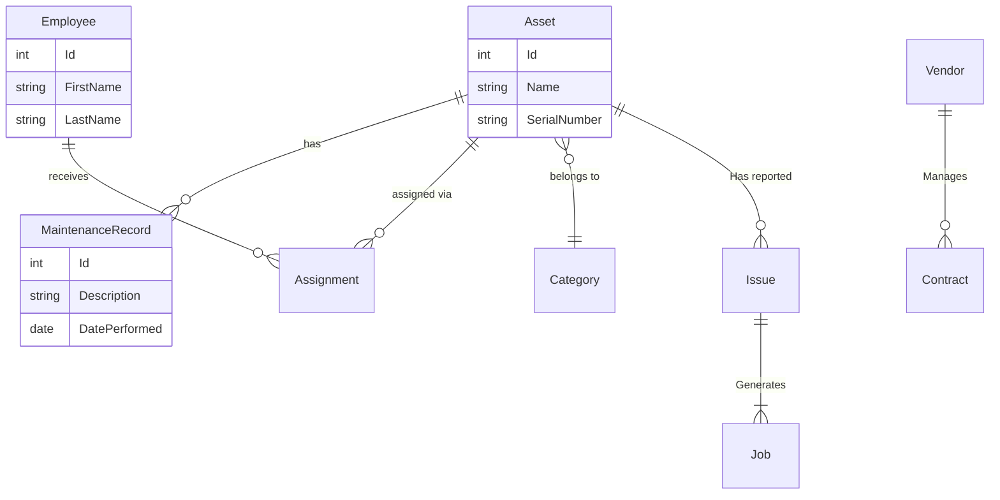

# AssetGuard

AssetGuard is a comprehensive corporate asset tracking and management application built with **.NET Core 2.1**, adhering to enterprise architectural patterns.

## System Architecture

```mermaid
graph LR
    API[AssetGuard.Api\n(Controllers)] --> Services[AssetGuard.Services\n(Business Logic)]
    Services --> Data[AssetGuard.Data\n(EF Context)]
    Data --> Core[AssetGuard.Core\n(Entities)]
    
    style API fill:#f9f,stroke:#333,stroke-width:2px
    style Services fill:#bbf,stroke:#333,stroke-width:2px
    style Data fill:#bfb,stroke:#333,stroke-width:2px
    style Core fill:#fbb,stroke:#333,stroke-width:2px
```

## Entity Relationships



## Architecture Overview

### 1. Core Layer (`AssetGuard.Core`)
Contains the domain entities, interfaces, and specifications. Note the use of `BaseEntity` and strongly-typed entities.
- **Key Entities**: `Asset`, `Employee`, `Vendor`, `Issue`, `Report`, `Document`
- **Interfaces**: `IRepository`, `IUnitOfWork`, `ISpecification`

### 2. Data Layer (`AssetGuard.Data`)
Implements the Data Access logic using Entity Framework Core.
- **AssetGuardContext**: Configures the database schema and relationships.
- **UnitOfWork**: Implements the Unit of Work pattern for transaction management.
- **SpecificationEvaluator**: Handles dynamic query generation.

### 3. Services Layer (`AssetGuard.Services`)
Contains business logic, DTO mappings, and domain services.
- **Services**: `AssetService`, `ReportingService`, `NotificationService`, `WorkflowService`.
- **DTOs**: Separate the domain model from the API contract.

### 4. API Layer (`AssetGuard.Api`)
The RESTful entry point.
- **Startup.cs**: Configured using `SetCompatibilityVersion(CompatibilityVersion.Version_2_1)` and IoC registration.
- **Controllers**: Granular controllers for each module (`AssetsController`, `ReportsController`, etc.).

## Key Modules
1.  **Core Assets**: Tracking, Categorization, and Assignments.
2.  **Maintenance**: Vendor management and maintenance logging.
3.  **Issue Tracking**: Ticketing system and job scheduling.
4.  **Reporting**: Dynamic dashboarding and report generation.
5.  **Notifications**: User subscriptions and alerts.
6.  **Documents**: Asset documentation and version control.
7.  **Workflows**: Approval processes for asset requests.

## Getting Started

1. Ensure .NET Core 2.1 SDK is installed.
2. Run `dotnet restore`.
3. Run `dotnet run` from the `AssetGuard.Api` directory.
